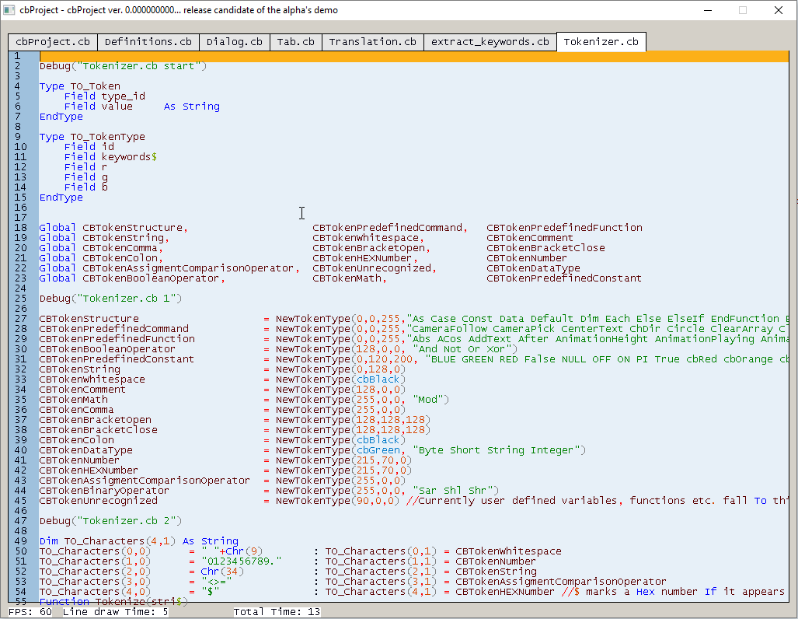
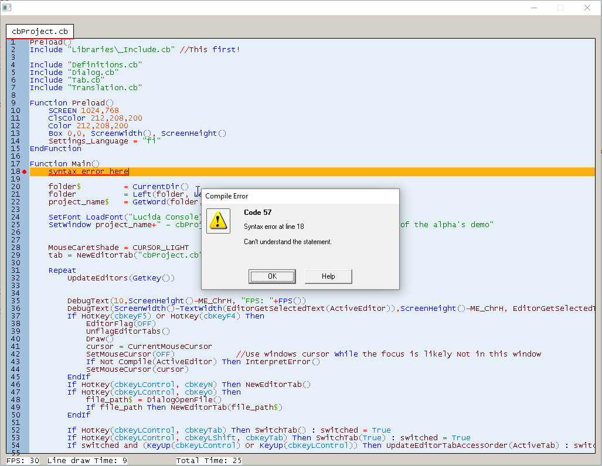
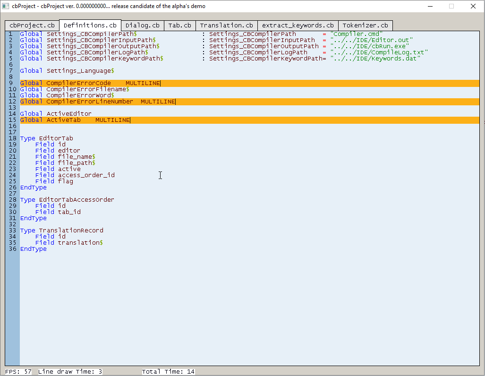

# cbProject
An editor for the Coolbasic programming language made with CoolBasic itself. I have to admit that the name is very unimaginative, hopefully the featurelist will make that up atleast at somepoint :).

NOTE that this is very incomplete at the moment! (Still has something that works :) ). No proimises are made whether the development will continue.

Syntax highlighting has a few bugs, but is quite nice still :).

Compiler errors are more prominent with the failing text row underlined.

The multi-caret feature has a working basic functionality, but can be improved though.

## Working features
- New tab (Ctrl + N)
- Open file (Ctrl + O).
- Switch tabs (Ctrl + Tab / Ctrl + Shift + Tab)
- Flag the tab and text line that failed to compile (the editor marks them with red underline)
- Multiple carets (Ctrl + click): type text and do other actions in multiple places at the same time.

## Partially working features
- Syntax highlighting: almost complete, only has some minor glitches where colors are used incorrectly. The fault lies somewhere in the tokenizer.
- Undo (Ctrl + Z) / Redo (Ctrl + Y) / Repeat (Ctrl + R): Needs a lot of testing. Also WILL crash if the undo history points to a deleted text line. The Repeat function multiplies the action you just did: for example, write "abc " and press Ctrl + R, you will end up with "abc abc " etc. Use Ctrl + U to start the "recording" of an action from the begining.
- Compile a file (F4 / F5): Only compiles, does not run. You need to specify the compiler path in the global settings variables. Should include the compiler in the project folder at some point.
- Scrolling (mouse scroll / Ctrl + Up / Ctrl + Down): only vertical scrolling works currently, and there are no visual scrollbars.
- Copy/Paste (Ctrl + C / Ctrl + V): Copying is supported at the moment. When copying multicaret highlights, the strings are glued together with Windows line breaks in between.
- Highlight text: can be done via keyboard. Lacks mouse implementation. Multicaret highlights should work somewhat OK too.

## Planned for 1.0
- **The core objective is to implement (almost) all the features of CBEditor, improve some of them and add some new ones. Nothing too complicated, simplicity is the most powerful tool.**
- Save file (Ctrl + S, and Ctrl + Shift + S for a "Save as...")
- Make Libraries\MultiEdit totally independent of the master project so that it can be used in what ever projects.
- Symbol name completion
- Syntax highlighting to recognize userdefined symbols
- A settings dialog window
- A project mode which lists all the project files in the left side and saves all modified files when you hit F5
- When caret is at a symbol, jump to the definition of the symbol when pressing a hotkey like Ctrl + B. If the symbol is defined in another file, open that file automatically to the editor.

## Exotic dreams
- **Something that are not actual goals, but could be investigated after completing the basic features**
- Some basic real time syntax checks

# Author

Jarkko "Jare" Linnanvirta
j@jare.fi
http://www.coolbasic.com/phpBB3/memberlist.php?mode=viewprofile&u=92
http://www.kpelit.fi

